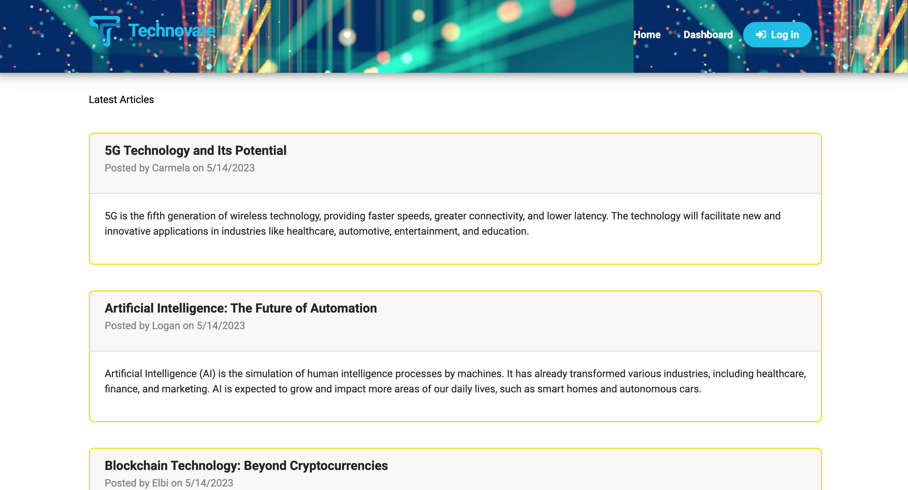
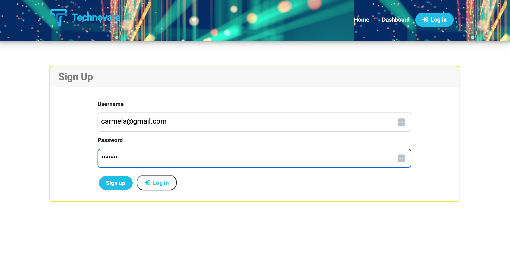
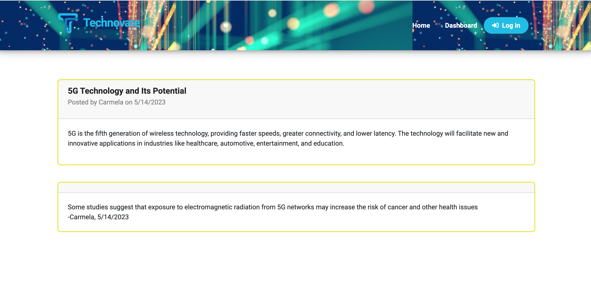

# Technovate

CMS-style blog following the MVC paradigm in its architectural structure.

## [Table of Contents](#table-of-contents)

- [Description](#description)
- [Final Result](#final-result)
- [Deployment](#deployment)
- [Installation](#installation)
- [Usage](#usage)
- [License](#license)
- [Tests](#tests)
- [Contact Me](#contact)

## [Description](#table-of-contents)

Technovate is a website that allows users to publish blog posts and comment other user's posts as well. It follows he MVC paradigm in its architectural structure, using Handlebars.js as the templating language, Sequelize as the ORM, and the express-session npm package for authentication.

`Technologies used:`

- JavaScript
- CSS
- Node.js
- Express.js
- MySQL2
- Sequelize
- Handlebars
- Heroku

## [Final Result](#table-of-contents)

## [Deployment](#deployment)

[Link to Heroku](https://technovate.herokuapp.com/)

## [Installation](#installation)

1. Install Node.js and MySQL on your machine.
2. Clone the repository to your local system.
3. Open the repository in your preferred code editor.
4. Install the required dependencies by running the following command in the terminal:

> package.json: npm i

5. Set the following environment variables with your MySQL database details:

> DB_NAME='techblog'  
> DB_USER='your_username'  
> DB_PW='your_password'

6. Open MySQL shell and insert the commands: 

> source db/schema.sql
> use techblog

7. Exit MySQL shell and start the app by running the following command in your terminal: 

> npm run seed
> node server.js

## [Usage](#table-of-contents)

To use Technovate, follow these steps:

1. Make sure the application is running by executing npm run seed followed by node server.js.
2. Access the application through your preferred web browser.
3. Sign up for a new account or log in if you already have one.
4. Create your tech posts and share with other users on the platform.
5. Comment posts from other users.

## [License](#table-of-contents)

Licenced under:

[MIT](https://choosealicense.com/licenses/MIT)

## [Tests](#table-of-contents)

To test this application, follow these steps:

1. Clone the repository to your local system.
2. Open the repository in your preferred code editor.
3. Complete the installation process as described in the Installation section.
4. Start the server and sync the Sequelize models with the MySQL database by running the command node server.js.
5. Use an API development environment (e.g., Insomnia) to test the API routes using various HTTP request methods such as GET, POST, PUT, and DELETE.

## [Contact Me](#table-of-contents)

- [GitHub](https://github.com/cdrcar)

- [Email: carmela881@outlook.com](mailto:carmela881@outlook.com)
